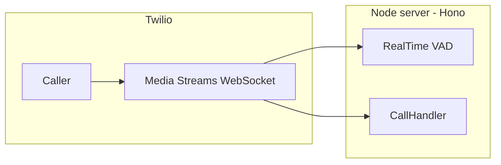

# ARIA — Multipurpose AI Voice Agent

A **production-ready, domain-agnostic voice AI platform** that connects any phone number to a conversational AI capable of understanding speech, reasoning, calling custom tools, and speaking back — **in the caller's own language**. Powered by [Twilio](https://www.twilio.com/) Media Streams, Google Gemini, and Deepgram.

The repository ships with a **medical clinic appointment booking** reference implementation, but the core infrastructure is fully decoupled from that domain. Swapping in a new use case means replacing the system prompt, tool definitions, and database schema — the call handling, audio pipeline, multilingual layer, VAD, and logging stay exactly as they are.

---

## What it can power

| Vertical | What the agent handles |
|----------|------------------------|
| 🏥 Healthcare (reference impl.) | Appointment booking, slot availability, SMS confirmations |
| 🏨 Hospitality | Hotel reservations, room service, concierge requests |
| 🍽️ Restaurants | Table reservations, takeaway orders, menu Q&A |
| 🛒 E-commerce | Order status, returns, customer support escalation |
| 🏦 Financial services | Account queries, loan pre-screening, fraud alerts |
| 🏠 Real estate | Property inquiries, viewing scheduling, lead capture |
| 🎓 Education | Course enrollment, tutor booking, campus information |
| 📦 Logistics | Delivery tracking, pickup scheduling, exception handling |
| 🧑‍💼 HR / Recruitment | Interview scheduling, candidate screening, FAQ |
| 🏛️ Government / Civic | Service appointments, information hotlines |

---

## Core capabilities (domain-agnostic)

- **Two interchangeable call handlers** — Gemini Live (audio-in/audio-out) or Sequential (Deepgram STT → Gemini LLM → TTS). Same public interface, toggle with one import change.
- **Automatic language detection** — 30+ languages via Deepgram's multilingual `nova-2` model; the agent switches language mid-call if the caller does.
- **Dual-provider multilingual TTS** — Deepgram Aura 2 for English, Google Cloud TTS for 40+ other languages.
- **Barge-in** — local Silero VAD detects caller speech onset in < 1 ms; clears Twilio's buffer and preempts Gemini instantly.
- **Structured tool calling** — LLM calls typed, schema-validated functions you define. Results flow back into the conversation automatically.
- **Configurable state machine** — guides the conversation through any multi-step flow (collect info → confirm → act → close).
- **Full transcript logging** — every caller and agent utterance timestamped and persisted to Supabase, along with the final call state.
- **SMS / outbound actions** — trigger Twilio SMS or any HTTP call from inside a tool.
- **Parallel TTS pipeline** (Sequential handler) — sentence N's audio fetch overlaps with Gemini generating sentence N+1, minimising time-to-first-audio.

---

## Adapting to a new domain

Three files control the domain-specific behaviour. Everything else stays the same.

| File | What to change |
|------|----------------|
| `src/conversation.ts` | Replace `BASE_SYSTEM_PROMPT` and the `tools` array (function declarations + descriptions). |
| `src/tools.ts` | Replace `executeTool()` and its implementations with your own API/database calls. |
| `src/stateMachine.ts` | Rename or add states if your flow differs from the default `GREETING → COLLECTING_INFO → CONFIRMING → BOOKED / FAILED`. |

Database schema (Supabase tables) also needs to match whatever your tools read and write.

---

## Architecture

Two interchangeable **call handlers** implement the same high-level behaviour with different pipelines. Choose one by editing the import in [`src/server.ts`](src/server.ts).



### Default: Gemini Live (`LiveCallHandler`)

- **Path:** audio in → **Gemini Multimodal Live** (WebSocket to Google) → audio out.
- No separate STT or TTS step — Gemini handles speech recognition, reasoning, and speech synthesis natively.
- Twilio sends **8 kHz µ-law**; the handler upsamples to **16 kHz PCM** for Gemini and converts Gemini's **24 kHz PCM** output back to **8 kHz µ-law** chunks for Twilio.
- Both input and output audio transcriptions are enabled so every utterance is logged in real time.
- Tool calls execute on the server; state updates are injected as synthetic `[SYSTEM STATE UPDATE]` user turns because the Live API does not allow mid-session system prompt changes.
- After a terminal tool call (e.g. booking confirmed), the handler waits for Gemini to deliver a goodbye audio turn before hanging up (15 s safety fallback).
- **Model:** `models/gemini-3.1-flash-live-preview` · **Voice:** `Aoede` (prebuilt Gemini voice).

### Alternative: Sequential STT → LLM → TTS (`SequentialCallHandler`)

- **Path:** **Deepgram** streaming STT (`nova-2`, multilingual) → **Gemini** text chat (`gemini-2.5-flash`) → **dual-provider TTS**.
- Deepgram runs in `language: multi` mode (30+ languages). The detected BCP-47 code drives both LLM language prompting and TTS provider selection.
- Sentences stream from Gemini and dispatch to TTS in parallel — each sentence's TTS fetch overlaps with the next sentence being generated.
- Includes 4-second silence reprompting, echo gating (300 ms post-speak cooldown), and a 2-layer tool-call safety net for critical actions.

#### Multilingual TTS

| Caller language | TTS provider | Notes |
|-----------------|--------------|-------|
| English (`en-*`) | **Deepgram Aura 2** (`aura-2-thalia-en`) | Low-latency, English-only |
| All other languages | **Google Cloud TTS** | 40+ languages, requires `GOOGLE_TTS_API_KEY` |

Falls back to English Deepgram voice if `GOOGLE_TTS_API_KEY` is not set.

**Shared across both handlers:** [`src/stateMachine.ts`](src/stateMachine.ts), [`src/tools.ts`](src/tools.ts), [`src/conversation.ts`](src/conversation.ts), [`src/db/callLog.ts`](src/db/callLog.ts).

---

## Tech stack

| Area | Technology |
|------|------------|
| Language / runtime | TypeScript, Node.js |
| HTTP + WebSockets | [Hono](https://hono.dev/), `@hono/node-server`, `@hono/node-ws` |
| Telephony | Twilio Voice, Media Streams, Programmable SMS |
| Live voice (default) | Gemini Live API — `gemini-3.1-flash-live-preview` (bidirectional WebSocket, audio-in/audio-out) |
| Sequential STT | Deepgram `nova-2` in `multi` language mode (30+ languages) |
| Sequential LLM | `@google/generative-ai` — `gemini-2.5-flash` with streaming function calling |
| Sequential TTS (EN) | Deepgram Aura 2 — `aura-2-thalia-en` (HTTP, µ-law 8 kHz) |
| Sequential TTS (non-EN) | Google Cloud TTS — 40+ languages, µ-law 8 kHz |
| VAD / barge-in | `@ericedouard/vad-node-realtime` (Silero ONNX model via `onnxruntime-node`) |
| Audio | `alawmulaw` (µ-law encode/decode), custom resampling and chunking |
| Database | Supabase client → PostgreSQL |
| Session cache | Upstash Redis REST — session keys deleted on hangup |

---

## Repository layout

```
voice_agent/
├── package.json
├── tsconfig.json
├── PROJECT.md              # Long-form design notes
├── FLOW.md                 # Deep-dive: every concept, file, and function explained
├── .env                    # Create locally — never commit
└── src/
    ├── server.ts               # Routes: /twiml, /media-stream, /audio, /
    ├── LiveCallHandler.ts      # Gemini Live handler (default)
    ├── SequentialCallHandler.ts# STT → LLM → TTS handler
    ├── conversation.ts         # ★ Domain config: system prompt + tool schemas
    ├── stateMachine.ts         # ★ Domain config: session model + call states
    ├── tools.ts                # ★ Domain config: tool implementations
    ├── intent.ts               # Affirmation / safety-net heuristics
    ├── sentenceSplitter.ts     # Streaming sentence extractor for parallel TTS
    ├── audio.ts                # Twilio µ-law payload → PCM
    ├── tts.ts                  # Dual-provider TTS + Twilio frame chunking
    ├── deepgram.ts             # Streaming STT with multilingual detection
    ├── test-client.ts          # Local WAV → /audio WebSocket test
    └── db/
        ├── supabase.ts
        ├── redis.ts
        └── callLog.ts
```

Files marked **★** are the ones you replace when adapting to a new domain.

---

## Prerequisites

- Node.js (compatible with `package.json` dependencies)
- **Google AI (Gemini)** API key — both handlers
- **Twilio** account (Voice, SMS)
- **Supabase** project (or swap in any PostgreSQL-compatible DB)
- **Deepgram** key — `SequentialCallHandler` STT + English TTS
- **Google Cloud TTS** key — optional, enables non-English TTS in sequential handler
- **Upstash Redis** — optional, session key cleanup on hangup

### Reference implementation schema (Supabase)

The bundled medical clinic demo expects these tables. Replace them with whatever your tools need.

- **`appointments`** — `confirmation_id`, `caller_phone`, `patient_name`, `appointment_date`, `appointment_time`, `reason`, `status`
- **`call_logs`** — `call_sid`, `caller_phone`, `started_at`, `ended_at`, `final_state`, `transcript` (JSON array), optional `appointment_id`

---

## Configuration

Create a `.env` file in the project root (never commit real secrets).

| Variable | Purpose |
|----------|---------|
| `PORT` | HTTP server port (default `3000`) |
| `NGROK_URL` | Public `https://…` base URL for TwiML stream URL construction |
| `GEMINI_API_KEY` | Google AI API key — Live handler + sequential LLM |
| `DEEPGRAM_API_KEY` | Deepgram STT and English TTS (sequential handler + `/audio` test endpoint) |
| `DEEPGRAM_TTS_MODEL` | Optional — overrides default Aura model (`aura-2-thalia-en`) |
| `GOOGLE_TTS_API_KEY` | Google Cloud TTS — enables non-English synthesis in sequential handler |
| `TWILIO_ACCOUNT_SID` | Twilio account SID |
| `TWILIO_AUTH_TOKEN` | Twilio auth token (SMS and call control) |
| `TWILIO_PHONE_NUMBER` | From-number for outbound SMS |
| `SUPABASE_URL` | Supabase project URL |
| `SUPABASE_ANON_KEY` | Supabase key (use service role server-side in production if appropriate) |
| `UPSTASH_REDIS_REST_URL` | Upstash Redis REST URL |
| `UPSTASH_REDIS_REST_TOKEN` | Upstash token |

Point your Twilio phone number's **Voice webhook** to `https://<your-public-host>/twiml` (e.g. via [ngrok](https://ngrok.com/) using `NGROK_URL`).

---

## Switching call handlers

In [`src/server.ts`](src/server.ts):

1. Import **one** of:
   - `import { CallHandler } from "./LiveCallHandler";` *(current default)*
   - `import { CallHandler } from "./SequentialCallHandler";`
2. Comment out the other.

The server branches on `handler.isNativeLive`: Deepgram STT is only attached for the sequential handler; Live mode sends PCM directly to Gemini.

---

## Scripts

```bash
npm install
npm run dev
```

- **`npm run dev`** — `tsx watch src/server.ts` (HTTP + WebSocket server with hot reload).
- **`npm run test:client`** — streams a WAV file to the `/audio` WebSocket for Deepgram-only transcription tests.

> [`src/test-client.ts`](src/test-client.ts) defaults to `ws://localhost:8080/audio`. Either run the server with `PORT=8080` or change `SERVER_URL` in the test client to match your configured `PORT`.

---
