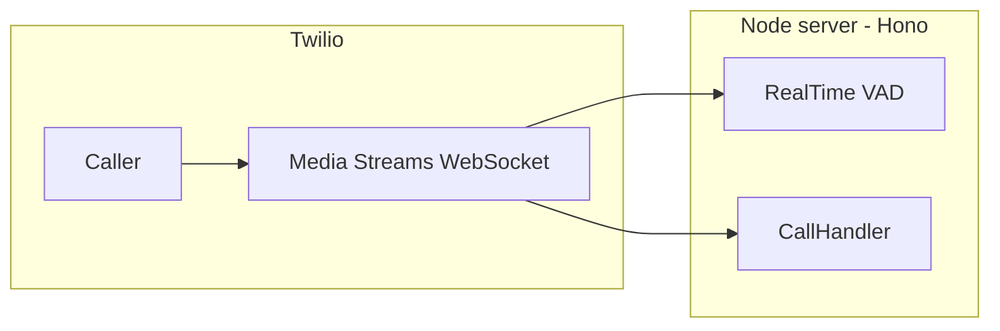

ARIA — AI Voice Receptionist 

A **phone-based AI receptionist** for a medical clinic. [Twilio](https://www.twilio.com/) Voice routes inbound calls and streams audio over WebSockets to a **Node.js** server. The server runs the conversation, calls tools to check availability and book appointments, and streams synthesized speech back to the caller.

---

## What it does

- Answers inbound calls and greets the caller.
- Collects appointment details (name, date, time, reason) through natural dialogue.
- Checks slot availability and writes confirmed bookings to **Supabase** (PostgreSQL).
- Sends an **SMS** confirmation via Twilio when appropriate.
- Tracks call state (`GREETING` → `COLLECTING_INFO` → `CONFIRMING` → `BOOKED` / `FAILED`).
- Supports **barge-in**: local voice-activity detection (VAD) can detect when the caller speaks over the agent; the server clears Twilio’s playback queue and coordinates with the active call handler.

---

## Architecture

Two interchangeable **call handlers** implement the same high-level behavior with different pipelines. You choose which one to use by editing the imports in [`src/server.ts`](src/server.ts).



### Default: Gemini Live (`LiveCallHandler`)

- **Path:** audio in → **Gemini Multimodal Live** (WebSocket to Google) → audio out.
- Twilio sends **8 kHz µ-law**; the handler converts for the model and converts **24 kHz PCM** from Gemini back to **8 kHz µ-law** chunks for Twilio.
- Tool calls are executed on the server; state updates can be injected as synthetic user turns (e.g. `[SYSTEM STATE UPDATE]`).
- **Model:** `models/gemini-2.0-flash-exp` (see setup message in [`src/LiveCallHandler.ts`](src/LiveCallHandler.ts)).

### Alternative: sequential STT → LLM → TTS (`SequentialCallHandler`)

- **Path:** **Deepgram** streaming STT (`nova-2`) → **Gemini** text chat (`gemini-2.5-flash` in [`src/conversation.ts`](src/conversation.ts)) → **Deepgram Aura** TTS (`aura-2-thalia-en` by default in [`src/tts.ts`](src/tts.ts)).
- Includes silence-based reprompting and extra guards against premature “booked” wording before `book_appointment` runs.

**Shared pieces:** [`src/stateMachine.ts`](src/stateMachine.ts) (session and states), [`src/tools.ts`](src/tools.ts) (Supabase + Twilio), [`src/conversation.ts`](src/conversation.ts) (tool schemas, prompts, and sequential-path `CallConversation`), [`src/db/callLog.ts`](src/db/callLog.ts) (transcripts and final state in Supabase).

---

## Tech stack

| Area | Technology |
|------|------------|
| Language / runtime | TypeScript, Node.js |
| HTTP + WebSockets | [Hono](https://hono.dev/), `@hono/node-server`, `@hono/node-ws` |
| Telephony | Twilio Voice, Media Streams, Programmable SMS |
| Live voice (default) | Gemini Generative Language API (bidirectional WebSocket) |
| Sequential path | `@google/generative-ai`, Deepgram SDK (STT + TTS HTTP) |
| VAD / barge-in | `@ericedouard/vad-node-realtime` (Silero; pulls in `onnxruntime-node`) |
| Audio | `alawmulaw` (µ-law encode/decode), custom resampling/chunking in handlers and [`src/tts.ts`](src/tts.ts) |
| Database | Supabase client → PostgreSQL (`appointments`, `call_logs`) |
| Optional cache | Upstash Redis REST ([`src/db/redis.ts`](src/db/redis.ts)) — used to delete session keys on hangup; `saveSession` / `getSession` helpers are available for extension |

---

## Repository layout

```
voice_agent/
├── package.json
├── tsconfig.json
├── PROJECT.md              # Long-form design notes (optional reading)
├── .env                    # Create locally — not committed
└── src/
    ├── server.ts           # Routes: /twiml, /media-stream, /audio, /
    ├── LiveCallHandler.ts  # Gemini Live (default handler)
    ├── SequentialCallHandler.ts
    ├── conversation.ts     # Tools, prompts, CallConversation (sequential)
    ├── stateMachine.ts
    ├── tools.ts
    ├── intent.ts           # Affirmation / premature-booking heuristics
    ├── sentenceSplitter.ts
    ├── audio.ts            # Twilio payload → PCM
    ├── tts.ts              # Deepgram TTS + Twilio frame chunking
    ├── deepgram.ts         # Streaming STT connection
    ├── test-client.ts      # Local WAV → /audio WebSocket test
    └── db/
        ├── supabase.ts
        ├── redis.ts
        └── callLog.ts
```

---

## Prerequisites

- Node.js (version compatible with the dependencies in `package.json`)
- Accounts / API keys: **Google AI (Gemini)**, **Twilio**, **Supabase**  
- **Deepgram** only if you use `SequentialCallHandler`  
- **Upstash Redis** if you want the Redis URL/token configured (handlers call `deleteSession` on teardown)

### Supabase schema (expected)

The code assumes tables including:

- **`appointments`** — e.g. `confirmation_id`, `caller_phone`, `patient_name`, `appointment_date`, `appointment_time`, `reason`, `status`, …
- **`call_logs`** — e.g. `call_sid`, `caller_phone`, `started_at`, `ended_at`, `final_state`, `transcript` (JSON), optional `appointment_id`

Align column names with [`src/tools.ts`](src/tools.ts) and [`src/db/callLog.ts`](src/db/callLog.ts), or adjust those modules to match your schema.

---

## Configuration

Create a `.env` file in the project root (never commit real secrets).

| Variable | Purpose |
|----------|---------|
| `PORT` | HTTP server port (default `3000`) |
| `NGROK_URL` | Public `https://…` base URL for TwiML stream URL construction |
| `GEMINI_API_KEY` | Google AI API key (Live + text paths) |
| `DEEPGRAM_API_KEY` | Required for sequential handler and `/audio` STT |
| `DEEPGRAM_TTS_MODEL` | Optional; overrides default Aura model in `tts.ts` |
| `TWILIO_ACCOUNT_SID` | Twilio account |
| `TWILIO_AUTH_TOKEN` | Twilio auth (e.g. SMS) |
| `TWILIO_PHONE_NUMBER` | From number for SMS tool |
| `SUPABASE_URL` | Supabase project URL |
| `SUPABASE_ANON_KEY` | Supabase key (use service role server-side in production if appropriate) |
| `UPSTASH_REDIS_REST_URL` | Upstash Redis REST URL |
| `UPSTASH_REDIS_REST_TOKEN` | Upstash token |

Point your Twilio phone number’s **Voice webhook** to `https://<your-public-host>/twiml` (e.g. via [ngrok](https://ngrok.com/) using `NGROK_URL`).

---

## Switching call handlers

In [`src/server.ts`](src/server.ts):

1. Import **one** of:
   - `import { CallHandler } from "./LiveCallHandler";` *(current default)*  
   - `import { CallHandler } from "./SequentialCallHandler";`
2. Comment out the other import.

The server already branches on `handler.isNativeLive`: Deepgram is only attached for the sequential handler; Live mode sends PCM straight to Gemini.

---

## Scripts

```bash
npm install
npm run dev
```

- **`npm run dev`** — `tsx watch src/server.ts` (HTTP + WebSocket server).
- **`npm run test:client`** — streams a WAV file to the **`/audio`** WebSocket for Deepgram-only transcription tests.

**Note:** [`src/test-client.ts`](src/test-client.ts) uses `ws://localhost:8080/audio` by default. Either run the server with `PORT=8080` or change `SERVER_URL` in the test client to match your `PORT`.

---

